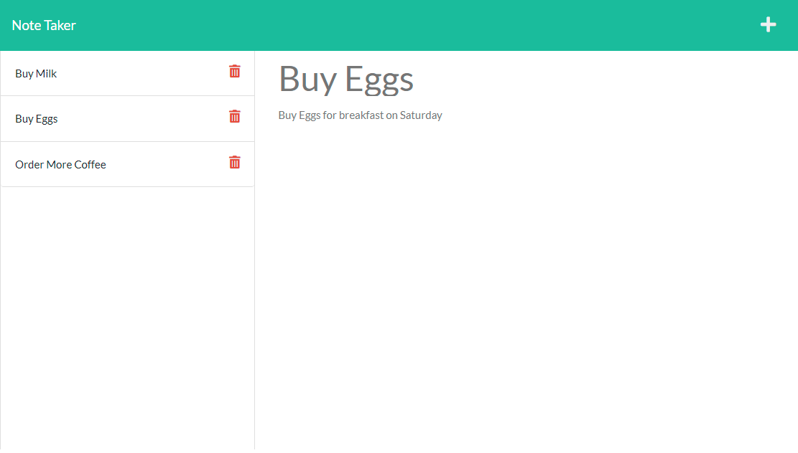

# Simple Note Taker - 
## Description
A Simple Note taking application

### [Deployed Application](https://ds-simple-note-taker.herokuapp.com/)
## Table of Contents

- [Installation](#installation)
- [Usage](#usage)
- [License](#license)
- [Technology](#technology)
- [Questions](#questions)
## Usage

1. Click 'Get Started' Button.
2. YOu will be presented with a list of previously saved notes on the left and Note Entry/View on the right.
3. Click on any previously saved note to view it on the right hand side.
4. Click the plus '+' icon in the upper right to clear the preview so you can enter a new note.
5. Click in the 'Note Title' section to enter you note title.
6. Hit tab or click into the 'Note Text' area to type in your note.
7. Click the save icon that appears directly left of the plus '+' icon to save your note.
8. To delete any of your notes simply Click the trashcan icon to the left side of the note you would like to delete.
### Preview Image

## License

MIT License

Copyright 2022 &copy; Daniel Stewart

Permission is hereby granted, free of charge, to any person obtaining a copy of this software and associated documentation files (the "Software"), to deal in the Software without restriction, including without limitation the rights to use, copy, modify, merge, publish, distribute, sublicense, and/or sell copies of the Software, and to permit persons to whom the Software is furnished to do so, subject to the following conditions:

The above copyright notice and this permission notice shall be included in all copies or substantial portions of the Software.

THE SOFTWARE IS PROVIDED "AS IS", WITHOUT WARRANTY OF ANY KIND, EXPRESS OR IMPLIED, INCLUDING BUT NOT LIMITED TO THE WARRANTIES OF MERCHANTABILITY, FITNESS FOR A PARTICULAR PURPOSE AND NONINFRINGEMENT. IN NO EVENT SHALL THE AUTHORS OR COPYRIGHT HOLDERS BE LIABLE FOR ANY CLAIM, DAMAGES OR OTHER LIABILITY, WHETHER IN AN ACTION OF CONTRACT, TORT OR OTHERWISE, ARISING FROM, OUT OF OR IN CONNECTION WITH THE SOFTWARE OR THE USE OR OTHER DEALINGS IN THE SOFTWARE.

## Technology

### Languages

- 
- 
- 

### Runtime

- 

### Packages

- 
- 
- 

### Deployment Environment

- 
## Questions 

If you have any questions or feedback you can contact me through one of the links below  
GitHub Profile - [danielstewart914](https://github.com/danielstewart914) 
Email - [danielstewart914@outlook.com](mailto:danielstewart914@outlook.com)
